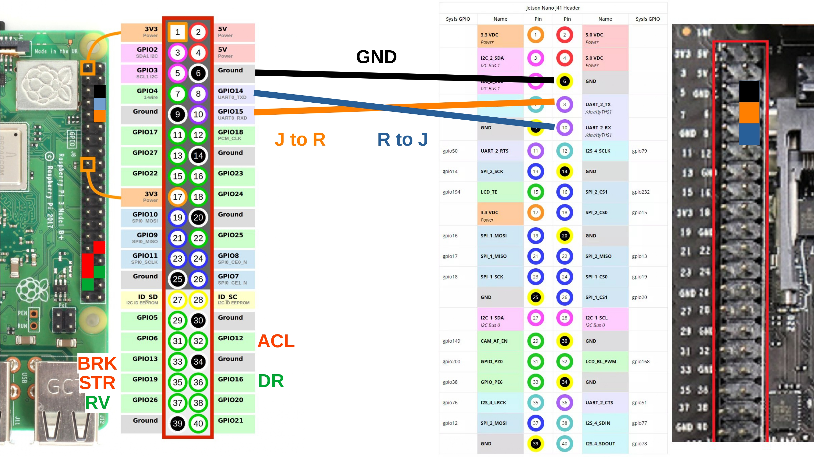

# PIUS の自律走行セットアップ方法

> [!CAUTION]
> このページに書かれた手順は、専用の取り付け器具を考慮しない場合のものです。
> 環境に合わせ、適宜変更してください。

> **補足**: システムには正常に PIUS 用のパッチが適用されていることが前提です。

# 各部品の組付け
1. JetsonNano／RaspberryPi に適切な microSD カードを挿入する
2. JetsonNano にカメラ／無線モジュールを取り付ける
    - カメラが適切に接続されていない場合、DonkeyCar 実行時にその旨のエラーが表示されます
    - 無線モジュールが適切に接続されていない場合、Bluetooth の設定画面が開けません
        - その場合でも有線での接続は可能です
3. JetsonNano と RaspberryPi をジャンパー線で接続する
4. RaspberryPi と PIUS をジャンパー線で接続する
5. RaspberryPi と JetsonNano をそれぞれ別のバッテリーに接続する
6. RaspberryPi とその接続バッテリーにモニターを接続する
7. PIUS の電源を投入し、ニューラルかつ PC 操作に設定する
8. JetsonNano の電源を投入するため、接続してるバッテリーの電源ボタンを押す
    - RaspberryPi の電源はここまでの操作で自然に投入されます
    - RaspberryPi を使用してる間は PIUS の電源を切らないようにしてください（RaspberryPi が再起動します）
9. PIUS／RaspberryPi／JetsonNano の電源が投入できていることを確認する

## ピンの配置



| 略称   | 内容                                           | 
| ------ | ---------------------------------------------- | 
| GND    | グラウンド                                     | 
| J to R | JetsonNano ⇒ RaspberryPi のシリアル通信ポート | 
| R to J | RaspberryPi ⇒ JetsonNano のシリアル通信ポート | 
| ACL    | PIUS のアクセル                                | 
| BRK    | PIUS のブレーキ                                | 
| STR    | PIUS のステアリング                            | 
| DR     | PIUS のシフト状態（ドライブ）                  | 
| RV     | PIUS のシフト状態（リバース）                  | 

> [!NOTE]
> 画像には含まれませんが、PIUS との接続ケーブルの 5.5V および GND 接続も行ってください。

# システムのセットアップ
## RaspberryPi 側
1. ターミナルを開き、以下のコマンドを実行します

```bash
sudo pigpiod
```

- これにより、`pigpiod` による処理が有効化されます

2. 続けて、以下のコマンドを実行します

```bash
python rec3.py
```

- これにより、実行ターミナルでレシーバプログラムが動作します
- もし該当ファイルがないと表示された場合、ホームディレクトリかデスクトップにあるはずです

3. ターミナルに`不完全なデータを受信`と繰り返し表示されていることを確認する
4. microHDMI を JetsonNano に付け替え、JetsonNano 側のセットアップへ移る

## JetsonNano側
1. ログイン ID `Jetson`、パスワード `Jetson` でログインします
2. ターミナルを開き、以下のコマンドを実行します

```bash
sudo chmod 777 /dev/ttyTHS1
```

3. 続けて、以下のコマンドを実行します

```bash
cd ~/mycar
python manage.py
```

4. 適切に実行できていれば、DonkeyCar のロゴ表示の後に実行ログが表示されます

## 諸注意

- 学習データの蓄積を行う場合、既存の教師データフォルダを削除してください
- ポーリングレートはインスタンスディレクトリ直下の `myconfig.py` で変更できます
